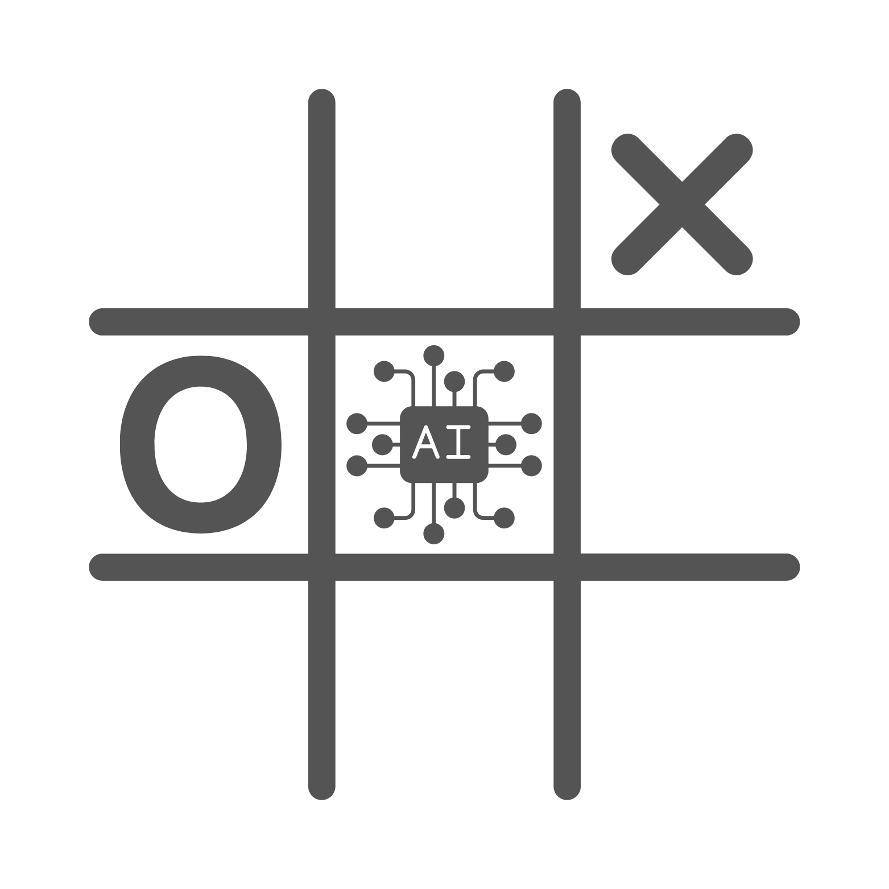

<p align="center">

</p>

# 🎮 Yet Another Tic-Tac-Toe

A **Tic-Tac-Toe** game built with **Preact**, **TypeScript**, **Vite**, and **Plain CSS**. This project showcases advanced **React/Preact** concepts like `Context`, `useImperativeHandle`, and includes **AI-powered moves**. It also features **machine learning** using **TensorFlow.js** for training and prediction, along with **Howler.js** for immersive audio effects.

---

## 🚀 Live Demo

🔗 [Play Now](https://gh.ahmadullah.in/tic-tac-toe)

---

## ✨ Features

- 🎨 **Lightweight & Fast** – Built with **Preact** and **Vite** for optimal performance.
- 🤖 **AI-Powered Opponent** – Uses the **Minimax Algorithm** for smart AI moves.
- 🔊 **Audio Effects** – Integrated **Howler.js** for smooth game sounds.
- 🎭 **Multiplayer & Singleplayer** – Play against AI or a friend.
- 🏗️ **Modern React Patterns** – Uses **Context API** & `useImperativeHandle` for modular component control.
- 🧠 **Machine Learning Integration** – **TensorFlow.js** enables AI to learn and improve over time.

---

## 🛠️ Tech Stack

- **[Preact](https://preactjs.com/)** – Lightweight alternative to React.
- **[TypeScript](https://www.typescriptlang.org/)** – For type safety & scalability.
- **[Vite](https://vitejs.dev/)** – Fast build & dev environment.
- **[Howler.js](https://howlerjs.com/)** – For game sound effects.
- **[TensorFlow.js](https://www.tensorflow.org/js/)** – Machine learning for training AI models.
- **Plain CSS** – Minimalistic styling without dependencies.

---

## 🤖 AI & Machine Learning

The game AI is powered by a combination of:

- **Minimax Algorithm** – Traditional decision-making for optimal moves.
- **TensorFlow.js** – **Trains and predicts moves** based on past gameplay.

### 🧠 **How TensorFlow.js Works in This Project**

- AI **learns from previous games** and adapts.
- **Trains on winning strategies** and improves predictions.
- **Predicts best moves** based on trained model & Minimax.

---

## 📚 Key Concepts Used

- **Context API** – Manages global game state efficiently.
- **useImperativeHandle** – Provides component-level control & flexibility.
- **Howler.js** – Adds immersive audio experience.
- **TensorFlow.js** – Handles training and prediction for AI moves.

---

## 📄 Setup & Installation

```bash
# Clone the repository
git clone https://github.com/aumirza/tic-tac-toe.git

# Navigate to the project directory
cd yet-another-tic-tac-toe

# Install dependencies
npm install

# Start the development server
npm run dev

# Build for production
npm run build
```

# 🎮 How to Play

- Choose Single Player (vs AI) or Multiplayer (vs a friend).
- Take turns placing X and O on the board.
- Win the game by getting three in a row (horizontal, vertical, or diagonal).
- Enjoy AI-powered moves, smooth animations, and sound effects!

# 🚀 Optimizations

- AI performance tuning for quicker decision-making.
- Optimized rendering to prevent unnecessary re-renders.
- Machine Learning Training for more dynamic AI playstyles.
- Audio preloading for seamless sound effects.

# 🤝 Contributing

Contributions are welcome! To contribute:

# Fork the repository

- Create a new branch (feature-name)
- Make your changes & commit
- Submit a pull request

# 📜 License

This project is licensed under the MIT License.
